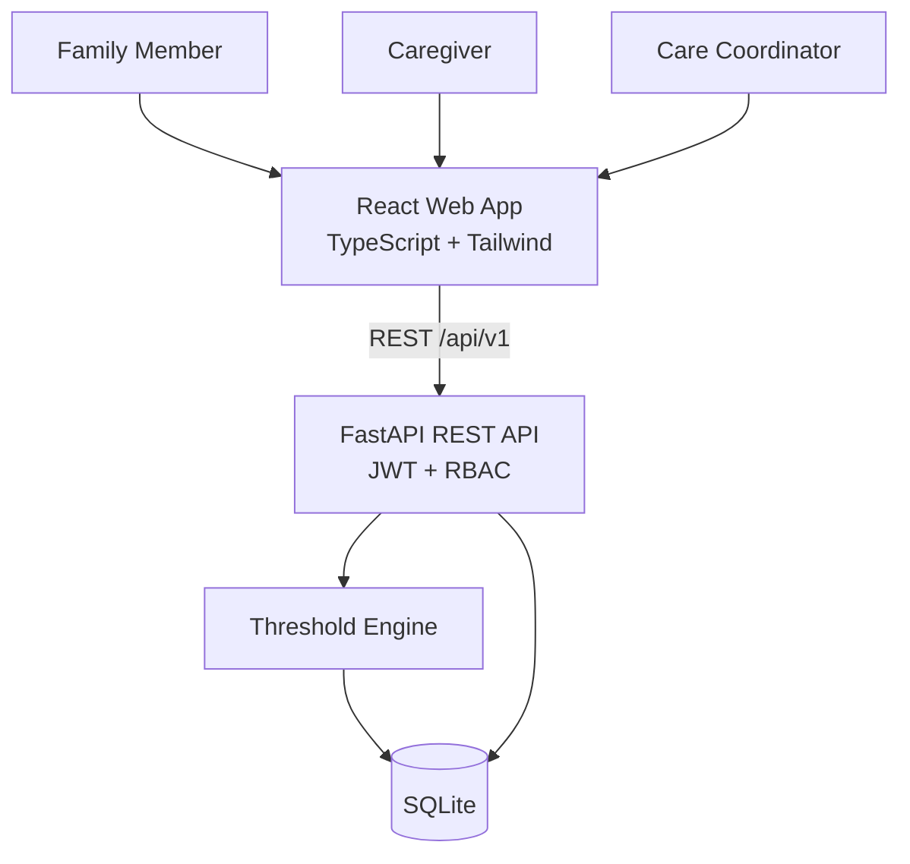
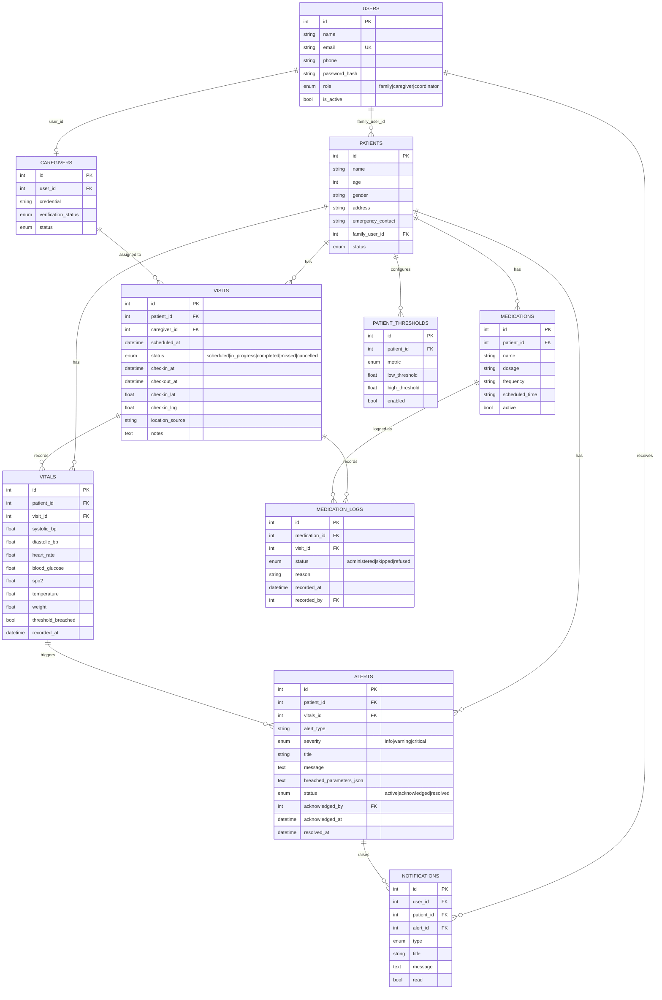
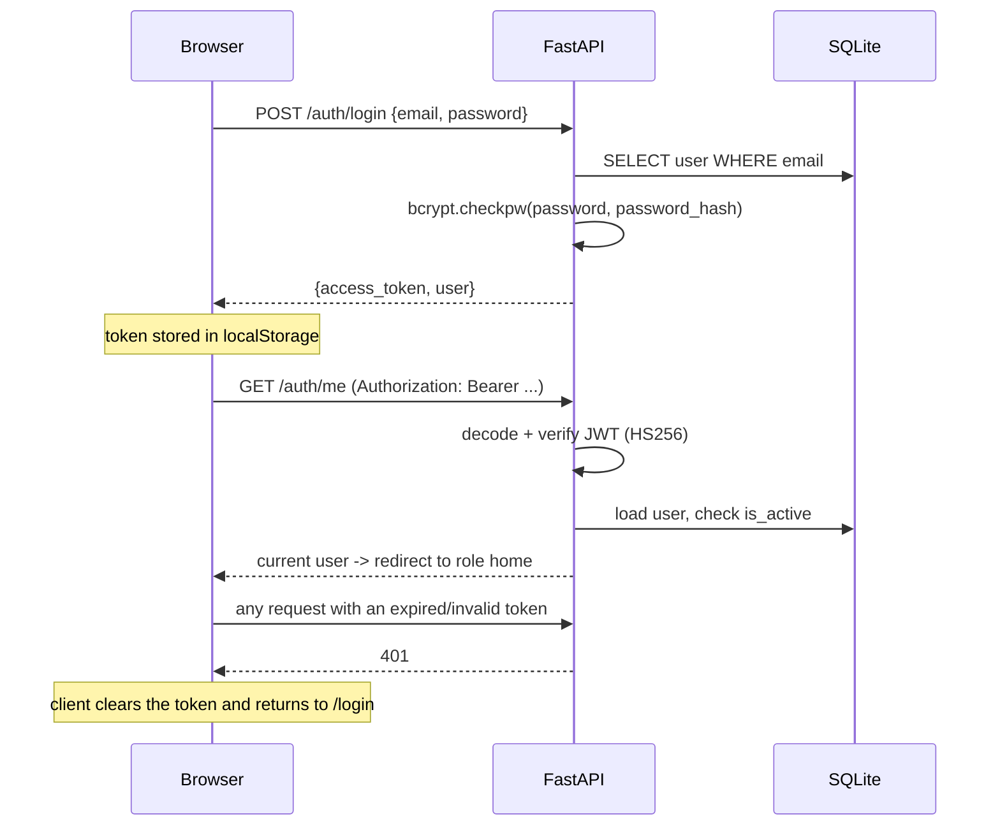
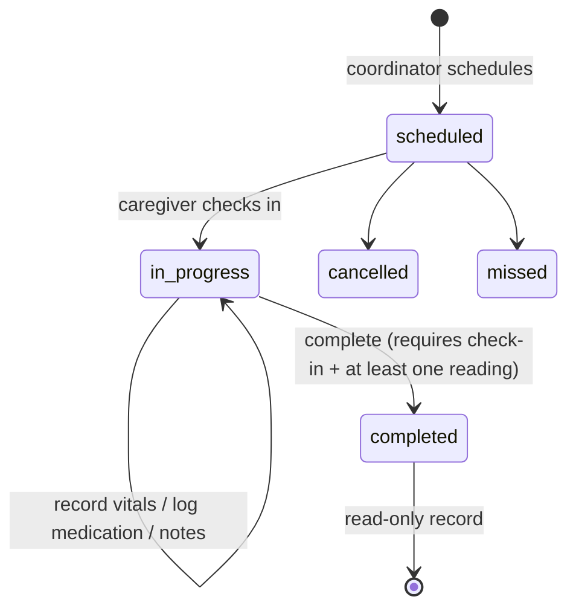
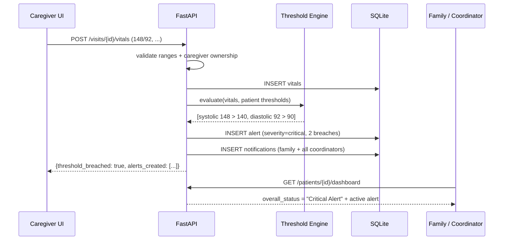
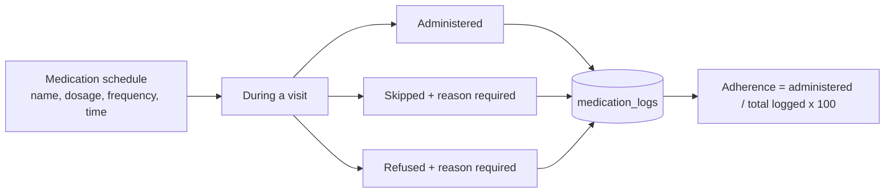

# DoorDoctor MVP - Design Document

Companion to [README.md](README.md). This document describes how the MVP is built, what each module
is responsible for, and how the MVP maps onto the production DoorDoctor architecture.

> Alerts in this system are **configured monitoring threshold events**, never medical diagnoses.

---

## 1. System overview

DoorDoctor turns a physical caregiver visit into a digital visibility layer for the family. Three
roles share one backend:

| Role | Sees | Can do |
|---|---|---|
| **Family** | Their own patients only | Read the dashboard, vitals, medications, visits, alerts; configure the medication schedule and thresholds |
| **Caregiver** | Only visits assigned to them | Check in, record vitals, log medication, add observations, complete the visit |
| **Coordinator** | All operational records | Schedule/assign visits, view patients and caregivers, acknowledge and resolve alerts |

The MVP runs entirely on local infrastructure: one FastAPI process, one SQLite file, one Vite dev
server. No external services are required.



---

## 2. Module responsibilities

### Backend

| Module | Responsibility |
|---|---|
| `app/main.py` | FastAPI app, CORS, router registration, validation-error shaping, `/health` |
| `app/config.py` | Environment-driven settings (`DATABASE_URL`, `JWT_SECRET`, CORS, token lifetime) |
| `app/database.py` | Engine, session factory, declarative `Base`, `now()` timestamp helper |
| `app/core/security.py` | bcrypt hashing, JWT issue/decode |
| `app/core/dependencies.py` | `get_current_user`, role guards, `authorize_patient`, `authorize_visit`, `authorize_caregiver_visit` |
| `app/core/exceptions.py` | Typed HTTP errors that always serialise to `{"detail": "..."}` |
| `app/models/` | SQLAlchemy 2.x models and enums |
| `app/schemas/` | Pydantic v2 request/response schemas (kept separate from ORM models) |
| `app/routers/` | HTTP surface only - parse, authorize, delegate |
| `app/services/` | All business logic |
| `app/seed.py` | Demo database reset + fictional dataset |

Service layer:

| Service | Responsibility |
|---|---|
| `auth_service` | Credential verification, token issue |
| `visit_service` | Visit listing, scheduling, assignment, lifecycle transitions, vitals capture |
| `vitals_service` | **Threshold engine**: load thresholds, compare, report breaches; vitals history |
| `alert_service` | Alert creation (severity, message), role-scoped listing, acknowledge/resolve |
| `medication_service` | Schedule CRUD, dose logging, adherence calculation |
| `notification_service` | In-app notification records for family + coordinators |
| `dashboard_service` | Single aggregation for the family dashboard |
| `coordinator_service` | Operational counts and the caregiver directory |

### Frontend

| Module | Responsibility |
|---|---|
| `src/api/` | One authenticated fetch client plus a module per resource; the only place that talks HTTP |
| `src/auth/` | `AuthContext` (token restore, login, logout) and `ProtectedRoute` |
| `src/hooks/useAsync.ts` | Uniform loading / error / data handling for every screen |
| `src/lib/format.ts` | Date, time, metric label and unit formatting |
| `src/lib/vitals.ts` | Client-side mirror of the threshold comparison, used only to colour the UI |
| `src/components/` | Layout, cards, chart, forms, alert presentation, shared primitives |
| `src/pages/` | One directory per role |

---

## 3. Data model



Health records are append-only in practice: once a visit is `completed`, its vitals, medication logs
and notes can no longer be edited, and nothing in the UI hard-deletes a health record.

---

## 4. API overview

All endpoints are under `/api/v1`; Swagger UI is served at `/docs`.

| Method | Path | Role | Purpose |
|---|---|---|---|
| POST | `/auth/login` | public | Exchange credentials for a JWT |
| GET | `/auth/me` | any | Current user |
| GET | `/patients` | family, coordinator | Patient list (family sees only its own) |
| GET | `/patients/{id}` | scoped | Patient profile |
| GET | `/patients/{id}/dashboard` | scoped | **Single aggregation** for the family dashboard |
| GET/POST | `/patients/{id}/medications` | scoped / family+coordinator | Medication schedule |
| GET | `/patients/{id}/medication-adherence` | scoped | Adherence summary |
| GET/PUT | `/patients/{id}/thresholds` | scoped / family+coordinator | Monitoring thresholds |
| GET | `/visits` | role-filtered | Visit list |
| GET | `/visits/today` | role-filtered | Today's worklist |
| POST | `/visits` | coordinator | Schedule a visit |
| POST | `/visits/{id}/assign` | coordinator | Assign a caregiver |
| GET | `/visits/{id}` | scoped | Visit detail (vitals, medications, logs) |
| POST | `/visits/{id}/checkin` | assigned caregiver | `scheduled -> in_progress` |
| POST | `/visits/{id}/vitals` | assigned caregiver | Record a reading + run the threshold engine |
| POST | `/visits/{id}/medication-logs` | assigned caregiver | Log one dose |
| POST | `/visits/{id}/notes` | assigned caregiver | Save observations |
| POST | `/visits/{id}/checkout` | assigned caregiver | Record check-out |
| POST | `/visits/{id}/complete` | assigned caregiver | `in_progress -> completed` |
| GET | `/alerts` | role-scoped | Alert list |
| GET | `/alerts/{id}` | family, coordinator | Alert detail with reading + thresholds |
| POST | `/alerts/{id}/acknowledge` | coordinator | Acknowledge |
| POST | `/alerts/{id}/resolve` | coordinator | Resolve |
| GET | `/notifications` | any | In-app notifications |
| POST | `/notifications/{id}/read` | owner | Mark read |
| GET | `/coordinator/summary` | coordinator | Live operational counts |
| GET | `/caregivers` | coordinator | Caregiver directory |

Errors are always `{"detail": "human readable message"}`:
`401` unauthenticated, `403` authenticated but not permitted, `404` missing **or not visible to you**,
`400` invalid state transition, `422` invalid input.

---

## 5. Authentication flow



Authorization is centralised in `app/core/dependencies.py`:

- `require_roles(...)` guards whole endpoints by role.
- `authorize_patient` / `authorize_visit` enforce ownership; a record belonging to another family
  returns **404**, so the API never reveals that it exists.
- `authorize_caregiver_visit` restricts every write during a visit to the assigned caregiver.

The frontend route guard mirrors these rules for usability only - the backend never trusts it.

---

## 6. Visit lifecycle



Enforced rules:

- Vitals and medication logs require an active check-in.
- Check-out is rejected before check-in.
- Completion requires at least one recorded reading.
- A completed visit cannot be re-completed, edited, or reassigned.

---

## 7. Alert flow (threshold engine)



Rules:

- Thresholds are **per patient** (`patient_thresholds`), seeded with the demo configuration and
  editable by the family member or a coordinator.
- Every enabled metric is compared; **all** breaches are collected before any alert is created.
- One reading produces **one alert** listing every breached parameter.
- Severity: one breach -> `warning`, two or more -> `critical`. This is a software demonstration
  rule, not a clinical severity model.
- Evaluation is synchronous inside the request, so the caregiver sees the result immediately.
- Alert copy is deliberately non-diagnostic: it states the value, the configured threshold and the
  direction, and ends with "This is a monitoring alert, not a medical diagnosis."

Seeded demo configuration:

| Metric | Low | High |
|---|---:|---:|
| Systolic BP | 90 | 140 |
| Diastolic BP | 60 | 90 |
| Heart rate | 50 | 100 |
| Blood glucose | 70 | 180 |
| SpO2 | 94 | 100 |
| Temperature (°F) | 95 | 100.4 |
| Weight (kg) | 35 | 120 |

---

## 8. Medication flow



- A reason is mandatory for `skipped` and `refused` (rejected with `422` otherwise).
- Re-submitting the same medication during the same visit **corrects** the existing log rather than
  duplicating it, so adherence cannot be inflated by repeated taps.
- With no logs at all the API returns `percentage: null` and the UI shows **"No data"** - never 0%,
  which would wrongly imply missed doses.

---

## 9. Frontend route map

```
/login                                public

/family                 (family)      -> /family/dashboard
/family/dashboard                     health status, vitals cards, trend chart, adherence, visits, alerts
/family/patient/:patientId            profile, thresholds, full reading history
/family/medications                   schedule + adherence + add medication
/family/alerts                        active and resolved alerts, alert detail

/caregiver              (caregiver)   -> /caregiver/visits
/caregiver/visits                     today's worklist
/caregiver/visits/:visitId            check-in, vitals form, medication logging, notes, completion

/coordinator            (coordinator) -> /coordinator/dashboard
/coordinator/dashboard                counts, today's visits, active alerts
/coordinator/visits                   schedule a visit, assign caregivers
/coordinator/patients                 patient directory
/coordinator/patients/:patientId      patient detail
/coordinator/caregivers               caregiver directory
/coordinator/alerts                   acknowledge / resolve
```

Navigating to another role's route redirects to the user's own home; an expired token clears the
session and returns to `/login`.

---

## 10. Security model

| Control | Implementation |
|---|---|
| Password storage | bcrypt hashes; plaintext is never stored, and hashes are never serialised |
| Authentication | HS256 JWT with `sub`, `role`, `iat`, `exp`; secret from `JWT_SECRET` |
| Authorization | Centralised dependencies; every endpoint is role- and ownership-checked server-side |
| Resource hiding | Another family's record returns `404`, not `403` |
| Input validation | Pydantic bounds on every vital; state-machine checks on every transition |
| CORS | Explicit allow-list from `CORS_ORIGINS` |
| Secrets | Environment variables only; `.env` git-ignored, `.env.example` committed |
| Logging | Errors are logged without patient names, phone numbers or vital values |
| Error surface | `{"detail": ...}` only - no stack traces reach the client |

Known prototype-level trade-offs: JWT in `localStorage`, no refresh tokens, no MFA/OTP, no rate
limiting, no immutable audit log.

---

## 11. MVP vs production architecture

| Concern | MVP | Production (SDD) |
|---|---|---|
| Database | SQLite | PostgreSQL + MongoDB event store |
| Cache | none / in-process | Redis |
| Async work | synchronous service call | SQS / RabbitMQ workers |
| Notifications | `notifications` table | FCM, Twilio SMS/WhatsApp, SendGrid |
| Caregiver client | responsive React web | React Native, offline-first (WatermelonDB) |
| Location | optional browser geolocation | GPS verification + geofencing |
| Realtime | REST + 30s notification poll | WebSockets |
| Auth | email + password JWT | OTP + MFA |
| Deployment | local process / Docker Compose | AWS ECS/Fargate, S3, CloudWatch |
| Billing | none | Razorpay subscriptions |
| Audit | application logs | immutable audit log |

---

## 12. Testing strategy

Backend (`backend/tests`, 73 tests):

| File | Covers |
|---|---|
| `test_auth.py` | Login success/failure, case-insensitive email, missing/invalid/expired tokens, no hash leakage |
| `test_authorization.py` | Cross-family isolation, caregiver visit isolation, role restrictions, coordinator access |
| `test_visits.py` | Scheduling, assignment, check-in/out ordering, completion prerequisites, immutability |
| `test_vitals.py` | Validation bounds, no alert in range, single vs multiple breaches, low breaches, patient-specific thresholds, non-diagnostic copy |
| `test_medications.py` | Schedule creation, dose logging, mandatory reasons, correction not duplication, adherence maths, "No data" |
| `test_alerts.py` | Family/coordinator visibility, alert detail, notifications, acknowledge/resolve, history retention, summary counts |

Each test runs against a throwaway copy of a freshly seeded database, so tests are isolated and order-independent.

Frontend (`frontend/src/test`, 11 tests): threshold evaluation helpers and the adherence card's
"No data" behaviour.

---

## 13. Known limitations

- Dashboards refresh on navigation rather than in real time (only the notification bell polls).
- Coordinator screens assume a small demo dataset - there is no pagination or search.
- Threshold editing is exposed through the API (`PUT /patients/{id}/thresholds`) but has no dedicated
  UI screen; the seeded configuration is shown read-only on the patient profile.
- Visit `missed`/`cancelled` states exist in the model but have no UI transition.
- One caregiver profile per user account.
- Timestamps are naive server-local; a multi-timezone deployment would need timezone-aware UTC.
- Bundle is shipped as a single chunk (~630 kB) - fine locally, but production would code-split.
